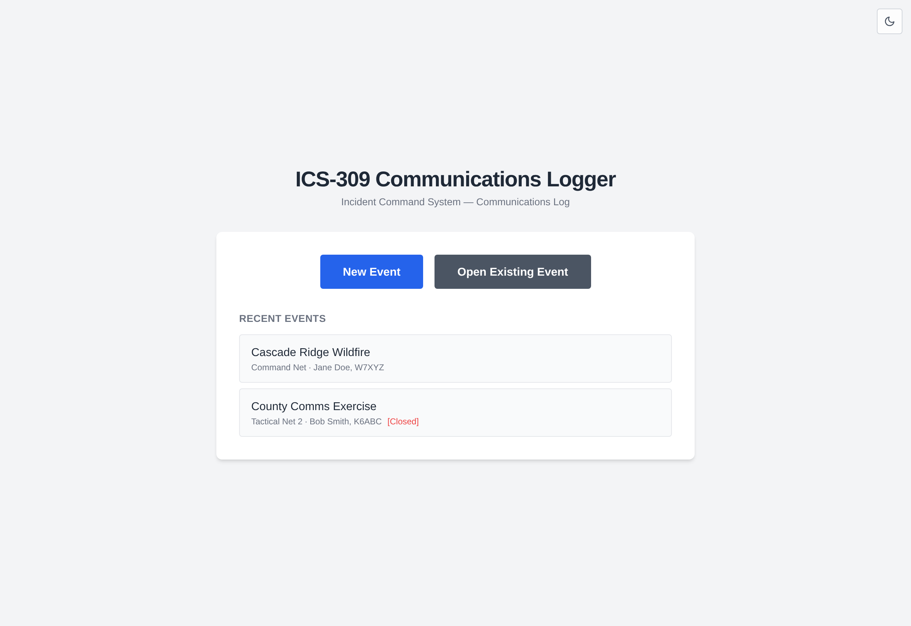
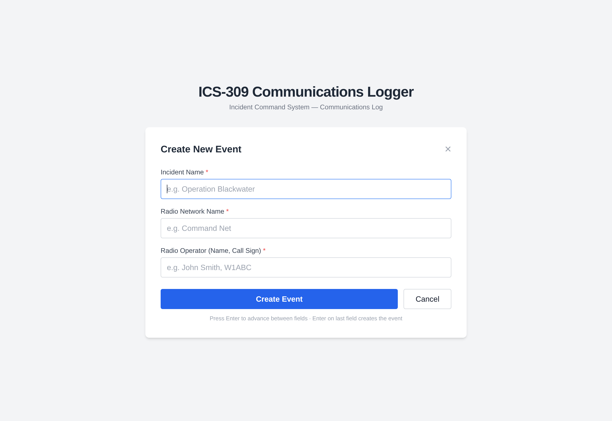
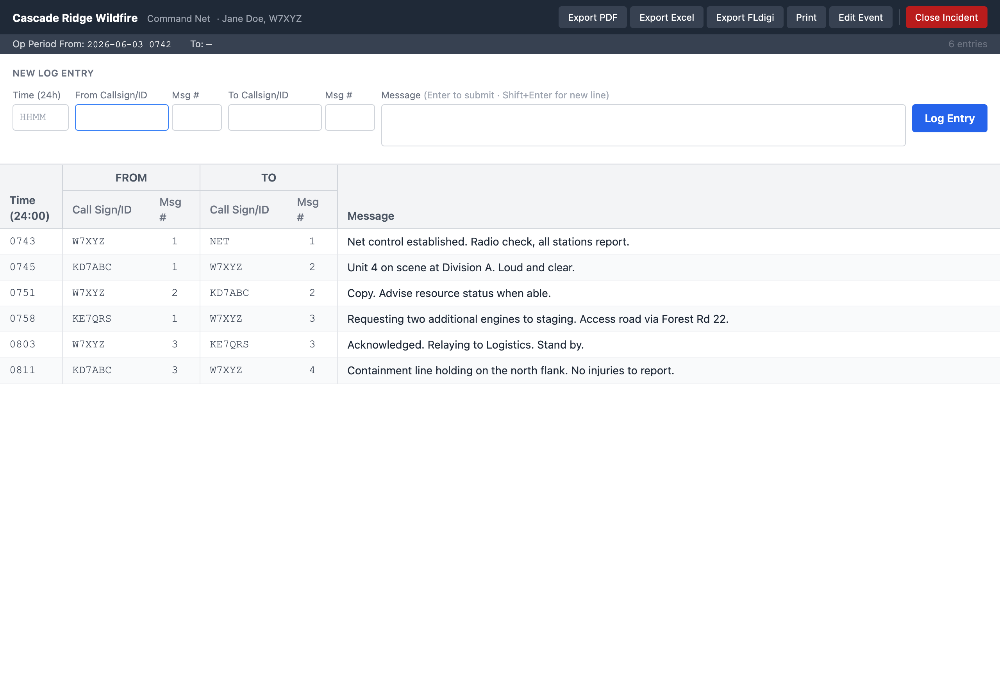
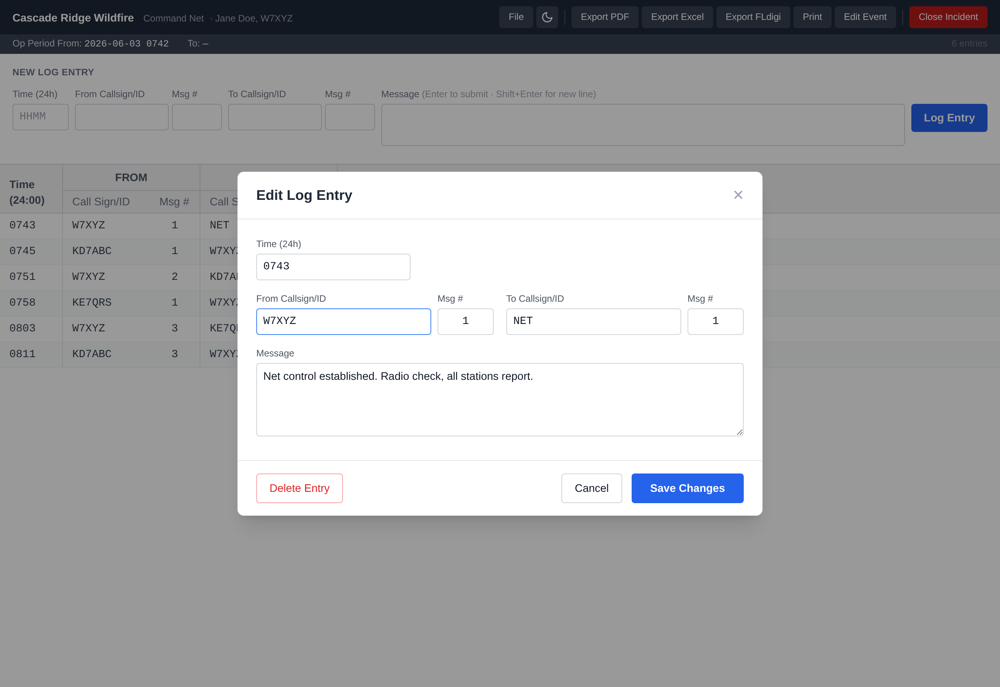

# ICS-309 Communications Logger

A cross-platform desktop application for capturing radio communications data and
producing a [FEMA **ICS-309 Communications Log**](https://training.fema.gov/icsresource/icsforms.aspx).
Built with [Tauri 2](https://tauri.app/), React, and SQLite.

The app is **portable** — it does not require installation and can be run from
removable media such as a USB flash drive. Its database lives next to the
executable, so the entire log travels with the drive.

---

## Getting Started

### Download a build

Pre-built downloads are published on the
**[Releases page](https://github.com/Reid-n0rc/ICS-309-Logger/releases)** for macOS,
Linux, and Windows:

- **Latest stable** — the most recent `vX.Y.Z` release (recommended).
- **Nightly** — the `nightly` pre-release is rebuilt from the latest commit on `main`
  every time it changes; use it to test the newest features.

**Every platform has a no-install option** — grab the portable download for yours:

| Platform | Portable download (no install) | What to do |
|---|---|---|
| **Windows** | `ICS-309-Logger_portable_windows_x64.zip` | Unzip, double-click `ICS-309 Logger.exe`. |
| **macOS (Apple Silicon)** | `..._aarch64.dmg` | M1/M2/M3/M4 — open it, drag the app out, run it. |
| **macOS (Intel)** | `..._x64.dmg` | Older Intel Macs — same as above. |
| **Linux (any distro)** | `..._amd64.AppImage` | `chmod +x` then run. |

Traditional installers are also provided if you prefer them: Windows
`..._x64-setup.exe` / `..._x64_en-US.msi`, Linux `..._amd64.deb` /
`....x86_64.rpm`.

### Run the app (no installation)

**Windows** — unzip `ICS-309-Logger_portable_windows_x64.zip` and double-click
**`ICS-309 Logger.exe`**. SmartScreen may warn on first launch (the build is unsigned):
click **More info → Run anyway**. Needs the Microsoft
[WebView2 runtime](https://developer.microsoft.com/microsoft-edge/webview2/),
which is preinstalled on Windows 11 and most up-to-date Windows 10 systems.

**macOS** — open the `.dmg` and drag **ICS-309 Logger** to wherever you want to run it
(a folder or your USB drive — Applications is optional). Because the build is unsigned,
the first launch is blocked: **right-click the app → Open → Open**. If you run it from a
USB drive and it won't start, clear the quarantine flag once:
```bash
xattr -dr com.apple.quarantine "/Volumes/<drive>/ICS-309 Logger.app"
```

**Linux** — make the AppImage executable and run it, from anywhere including a flash drive:
```bash
chmod +x ICS-309*.AppImage
./ICS-309*.AppImage
```

> **Portable by design:** the app stores everything in a single SQLite file,
> `ics309_data.db`, created **next to the app** on first run. Copy the portable build to
> a USB flash drive and the whole communications log travels with it — no installation,
> nothing left behind on the host machine. (If the app is ever launched from a read-only
> location, it falls back to a per-user data folder so it still runs.)

### Run from source

```bash
npm install            # one-time: install dependencies
npm run tauri dev      # launch the app
```

> Requires [Node.js](https://nodejs.org/) 18+ and the [Rust](https://rustup.rs/)
> stable toolchain. See [Development](#development) for full setup and how to build a
> release binary.

### Use it in 60 seconds

1. **Start an event.** On the startup screen, click **New Event**, fill in *Incident
   Name*, *Radio Network Name*, and *Radio Operator* (press `Enter` to move between
   fields). Pressing `Enter` on the last field creates the event and stamps the start
   time. Already have one? Click **Open Existing Event** or pick from **Recent Events**.

2. **Log a transmission.** In the entry form at the top:
   - Type the **From Call Sign/ID** → `Enter` (the From Msg # auto-fills for that call sign).
   - Type the **To Call Sign/ID** → `Enter` (the To Msg # auto-fills).
   - Type the **Message** (`Shift+Enter` for a new line; misspellings are underlined).
   - Press `Enter` to log it. The time fills in automatically if you didn't set it.

   The entry drops into the table below and the form resets for the next one.

3. **Fix something.** Double-click any row to edit its fields or delete it. Drag the
   divider above the table to resize the log area.

4. **Export or print.** Use the menu bar: **Export PDF**, **Export FLdigi**, or
   **Print** to produce a formatted ICS-309.

5. **Close out.** Click **Close Incident** to record the stop time and return to the
   startup screen. (Start/stop times remain editable via **Edit Event**.)

See [Logging workflow](#logging-workflow) below for the full field-by-field flow.

---

## Features

- **Event-based workflow** — create a new event or reopen an existing one on startup.
- **Fast keyboard-driven logging** — `Enter` advances between fields; the cursor
  follows the natural flow of a radio exchange.
- **Automatic message numbering** — message numbers auto-increment *per call sign*,
  separately for the FROM and TO directions. Manual entries are never overwritten.
- **Constant spell check** — the message field uses native browser spell check
  (red underline on misspellings, right-click for suggestions), just like a word
  processor or web form.
- **Resizable, scrollable log table** — drag the divider to resize; double-click any
  row to edit or delete it.
- **Export & print**
  - **PDF** — a formatted ICS-309 matching the official layout.
  - **FLdigi** — an `.flmsg`-style file for use with [FLdigi](http://www.w1hkj.com/).
  - **Print** — sends a formatted ICS-309 to the printer.
- **Open / close incidents** — closing an incident records the *To* (stop) date/time
  and returns to the startup screen. All dates/times can be edited manually.
- **Lightweight local storage** — a single SQLite database file (`ics309_data.db`).

---

## Screenshots

### Startup — create or open an event
On launch, choose to start a **New Event** or **Open Existing Event**. Recent events
are listed for one-click access; closed incidents are marked.



### New event
Three fields — Incident Name, Radio Network Name, and Radio Operator. Press `Enter`
to advance; pressing `Enter` on the last field creates the event and records the
*From* (start) date/time automatically.



### Communications log
The main logging screen. The entry form sits at the top, with a running table of
previous entries below. The menu bar provides Export PDF, Export FLdigi, Print,
Edit Event, and Close Incident.



### Edit an entry
Double-click any row to edit its time, call signs, message numbers, or message text —
or delete it entirely.



---

## Logging workflow

The entry form is designed to match the cadence of a real radio exchange:

1. The cursor starts on **From Call Sign/ID**. (You may optionally click the **Time**
   field first and type a 24-hour time; otherwise it is filled automatically on submit.)
2. Type the **From Call Sign/ID** and press `Enter`. The **From Msg #** auto-populates
   with the next sequential number for that call sign, and the cursor moves to
   **To Call Sign/ID**. You can step back into the Msg # field to override it; a manual
   value is preserved.
3. Type the **To Call Sign/ID** and press `Enter`. The **To Msg #** increments for that
   call sign and the cursor moves to **Message**.
4. Type the **Message**. `Shift+Enter` inserts a new line; spell check underlines
   misspellings.
5. Press `Enter` to log the entry. If the Time field was left blank, the current time
   is recorded. The row appears in the table below and the form resets for the next entry.

---

## Form field mapping (ICS-309)

| ICS-309 box | App field |
|---|---|
| 1. Incident Name | Incident Name |
| 2. Operational Period (From/To) | Auto-recorded on event open/close; manually editable |
| 3. Radio Network Name | Radio Network Name |
| 4. Radio Operator (Name, Call Sign) | Radio Operator |
| 5. Communications Log | The entry table (Time, From CS/ID + Msg #, To CS/ID + Msg #, Message) |
| 6. Prepared By | Radio Operator |
| 7. Date & Time Prepared | Generated at export/print time |

---

## Tech stack

- **[Tauri 2](https://tauri.app/)** — native desktop shell (Rust)
- **React 18 + TypeScript** — UI
- **Tailwind CSS** — styling
- **SQLite** via [`rusqlite`](https://github.com/rusqlite/rusqlite) (bundled) — storage
- **[jsPDF](https://github.com/parallax/jsPDF)** + jspdf-autotable — PDF export

---

## Project structure

```
ICS-309-Logger/
├── index.html
├── package.json
├── vite.config.ts
├── tailwind.config.js
├── src/                          # Frontend (React + TypeScript)
│   ├── App.tsx                   # Root: switches between startup and log views
│   ├── types.ts                  # Shared TypeScript interfaces
│   ├── lib/
│   │   └── exportPdf.ts          # jsPDF ICS-309 layout
│   └── components/
│       ├── StartupView.tsx       # New / open event + recent list
│       ├── NewEventForm.tsx      # 3-field event creation
│       ├── EventList.tsx         # Browse existing events
│       ├── LogView.tsx           # Main logging screen, menu, print, FLdigi
│       ├── EntryForm.tsx         # Entry form + keyboard navigation
│       ├── LogTable.tsx          # Running table of entries
│       └── EditEntryModal.tsx    # Edit / delete an entry
└── src-tauri/                    # Backend (Rust)
    ├── Cargo.toml
    ├── tauri.conf.json
    ├── capabilities/default.json
    └── src/
        ├── main.rs
        ├── lib.rs                # Tauri bootstrap + command registry
        ├── db.rs                 # SQLite init + portable data-dir resolution
        ├── models.rs             # Serde structs
        └── commands.rs           # All Tauri commands
```

---

## Data storage

All data is stored in a single SQLite file, **`ics309_data.db`**, written next to the
app — alongside the `.exe` (Windows), beside the `.app` bundle (macOS), or next to the
`.AppImage` (Linux, resolved via the `$APPIMAGE` path so it works despite the read-only
runtime mount). This keeps the app self-contained and portable — copy the app and its
database to a flash drive and the full log goes with it. If the app is launched from a
read-only location, it falls back to a writable per-user data directory so it still runs.

Schema:

- **`events`** — one row per incident (names, operator, from/to date-time).
- **`log_entries`** — one row per communication, linked to an event.
- **`callsign_counters`** — tracks the last message number used per call sign and
  direction, enabling sequential auto-numbering.

---

## Development

### Prerequisites

- [Node.js](https://nodejs.org/) 18+
- [Rust](https://rustup.rs/) (stable toolchain)
- Platform dependencies for Tauri — see the
  [Tauri prerequisites guide](https://tauri.app/start/prerequisites/).

### Install & run

```bash
npm install            # install frontend dependencies
npm run tauri dev      # launch the app in development mode
```

### Build a release binary

```bash
npm run tauri build
```

The bundled application is written to `src-tauri/target/release/` (and platform
bundles under `src-tauri/target/release/bundle/`).

### CI/CD (GitHub Actions)

Four workflows drive continuous integration and delivery. Builds target
**macOS (Apple Silicon + Intel), Linux, and Windows** via
[`tauri-action`](https://github.com/tauri-apps/tauri-action).

| Workflow | Trigger | What it does |
|---|---|---|
| [`verify.yml`](.github/workflows/verify.yml) | Every push & PR (all branches) | On **macOS, Linux, and Windows**: type-check, build the frontend, run the backend **feature tests** (`cargo test`), and **smoke-launch the built app** to confirm it starts and initializes its database on each OS. |
| [`nightly.yml`](.github/workflows/nightly.yml) | Every push to `main` | Builds all platforms and publishes them to a single rolling **`nightly`** pre-release, recreated each run so it always tracks the latest commit. |
| [`release.yml`](.github/workflows/release.yml) | Push of a `v*` tag (or manual dispatch) | Builds all platforms and creates a **stable, versioned** GitHub Release (as a draft to review before publishing). |
| [`screenshots.yml`](.github/workflows/screenshots.yml) | Push to `main` touching GUI source | Regenerates the README screenshots from the built UI and commits any changes back (auto-commit carries `[skip ci]`, so it doesn't trigger rebuilds). |

**Cross-OS verification.** Every feature (event lifecycle, log entries, per-call-sign
auto message numbering, FLdigi export) is covered by Rust integration tests that run on
all three operating systems, and the actual app binary is launched on each OS to confirm
it runs. Full click-through UI automation isn't included because `tauri-driver` does not
support macOS (WKWebView has no WebDriver); the feature tests plus the per-OS launch and
multi-OS release builds provide the cross-platform guarantee instead.

**Continuous builds:** every commit to `main` produces downloadable installers on the
[Releases page](https://github.com/Reid-n0rc/ICS-309-Logger/releases) under the
`nightly` pre-release.

**Cutting a stable release:**

1. Bump the version in `src-tauri/tauri.conf.json` (and `package.json`).
2. Tag and push:
   ```bash
   git tag v0.1.0
   git push origin v0.1.0
   ```
3. `release.yml` builds every platform and creates a **draft** Release with the bundles
   attached. Review it and click **Publish**.

> No signing certificates are configured, so the macOS/Windows bundles are unsigned —
> users may need to bypass Gatekeeper/SmartScreen on first launch.

### Type-check / tests

```bash
npx tsc --noEmit                       # TypeScript
cd src-tauri && cargo test             # Rust backend feature tests
```

### Regenerating screenshots

The screenshots in `docs/screenshots/` are produced by a headless harness that stubs
the Tauri API with sample data. They are **regenerated automatically by CI**
([`screenshots.yml`](.github/workflows/screenshots.yml)) whenever GUI source changes
on `main`, so they stay in sync with the interface. To regenerate them locally:

```bash
npm install --no-save puppeteer   # one-time, if not already present
npm run build
npx vite preview --port 4173 &
node scripts/screenshot.mjs
```

---

## License

Licensed under the [MIT License](LICENSE) — © 2026 Reid Crowe.

You may freely use, modify, and distribute this software, including for commercial
purposes. The only condition is **attribution**: the copyright notice and the MIT
license text must be retained in copies or substantial portions of the software.
