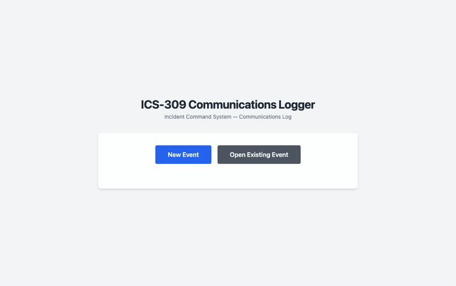

# ICS-309 Communications Logger

A portable desktop app for capturing radio traffic and producing **ICS-309 Communications Logs**.



## Download

Download the latest builds from the
[Releases page](https://github.com/Reid-n0rc/ICS-309-Logger/releases/latest).

## Get started

- **Windows**: download `ICS-309-Logger_portable_windows_x64.zip`, unzip, run `ICS-309 Logger.exe`.
- **macOS**: download the correct `.dmg` (`aarch64` for Apple Silicon, `x64` for Intel), open it, and drag out the app.
- **Linux**: download `..._amd64.AppImage`, then run:

```bash
chmod +x ICS-309*.AppImage
./ICS-309*.AppImage
```

- **Android**: download `ICS-309-Logger_<version>_android.apk` and install it (enable
  "install from unknown sources" for your browser/file manager). The UI adapts to phone
  and tablet screens.

## Documentation

Detailed documentation is on the project docs site:

- **[Getting Started](https://reid-n0rc.github.io/ICS-309-Logger/getting-started.html)** — full download &amp; run guide, 60-second quickstart, logging workflow, features, data storage, and development setup.

## Run from source

```bash
npm install
npm run tauri dev
```

Requires Node.js 18+ and Rust stable.
